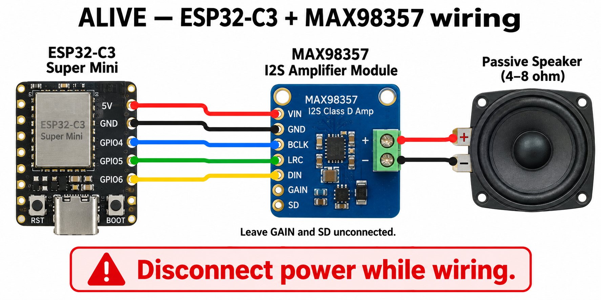

# ALIVE

ALIVE has a live hardware demo path:

```text
phone prompt -> laptop LLM API -> ESP32 -> MAX98357 -> speaker
                                             -> phone microphone -> browser decoder
```

The phone sends a player prompt to the laptop. The laptop creates a reply of at most 20 characters, then queues it for an ESP32. The ESP32 synthesizes the reply as short dual-tone bursts through a MAX98357 I2S amplifier and speaker. The phone microphone decodes those bursts back into text.

## ESP32 + MAX98357 live demo

This demo needs an ESP32-C3 Super Mini, the MAX98357 board shown in the project notes, and a 4–8 ohm passive speaker. The amplifier is an output device; it does not contain a microphone.

Wire the boards with power disconnected:

| ESP32-C3 | MAX98357 |
| --- | --- |
| `5V` | `VIN` |
| `GND` | `GND` |
| `GPIO4` | `BCLK` |
| `GPIO5` | `LRC` |
| `GPIO6` | `DIN` |

Connect the speaker directly to the green `+` and `-` terminals. Leave `GAIN` and `SD` unconnected for the first demo.



Configure and flash the device:

```bash
cp firmware/esp32_i2s_emitter/include/secrets.example.h \
  firmware/esp32_i2s_emitter/include/secrets.h
# Edit secrets.h: Wi-Fi details and this laptop's LAN IP.
cd firmware/esp32_i2s_emitter
pio run --target upload
pio device monitor
```

Start the laptop service from the repository root:

```bash
export OPENAI_API_KEY=...
python emitter.py --device-output
```

Open the printed URL on the phone and accept the local certificate warning. Tap **enable microphone**, wait for calibration, enter a prompt, and tap **send**. Keep the phone near the speaker. The ESP32 polls the laptop, plays each queued reply once, and the page shows the decoded text. **Play signal** queues the same reply again.

For a demo without an API key, deterministic replies remain available. For example, `hello are you alive` produces `I AM HERE`.

## Run

Build the phone app after frontend changes:

```bash
cd web
bun install
bun run build
cd ..
```

Start the emitter:

```bash
python emitter.py
```

Then scan/open the printed phone URL, accept the local HTTPS warning if needed, tap **Enable microphone**, and type `start` in the emitter terminal.

## Reply API

The laptop server is the temporary signal API before the NAS exists. The phone page includes a contact form; when served from the laptop it posts to the same origin by default.

```bash
curl -X POST http://127.0.0.1:8765/api/message \
  -H 'content-type: application/json' \
  -d '{"message":"hello are you alive"}'
```

The generated reply is sanitized to A-Z plus spaces and capped at 20 characters. With `--device-output`, the ESP32 plays it once. Without that flag, the laptop speakers play it. It does not loop automatically. Use the web page's **play signal** button to replay the current signal; the button stays locked until the current audio duration has elapsed.

Without `OPENAI_API_KEY`, the server uses deterministic fallback replies for local testing. With an API key:

```bash
export OPENAI_API_KEY=...
export ALIVE_OPENAI_MODEL=gpt-5.4-mini
python emitter.py
```

The ESP32 I2S emitter polls this transport:

```text
GET /api/emitter/main/current
```

```json
{
  "emitterId": "main",
  "revision": 1,
  "message": "I AM HERE",
  "mode": "language",
  "maxChars": 20,
  "duration": 9.23,
  "active": true
}
```

The web replay button calls:

```text
POST /api/emitter/main/play
```

## Live Controls

While `python emitter.py` is running:

```text
start                   start the current signal
stop                    stop the current signal
message <text>          change encoded message
ask <text>              generate a max-20-char reply and play it
language / clock / burst  change signal type
status                  show current sender state
quit                    stop the server
```

Useful flags:

```bash
python emitter.py --message "HELLO WORLD"
python emitter.py --message TEST --horn
python emitter.py --signal clock
python emitter.py --signal burst
python emitter.py --http
```

Microphone access usually requires HTTPS. Use `--http` only for local desktop testing.

## Project Layout

- `emitter.py` serves the built phone app and controls the laptop audio emitter.
- `audio_message.py` generates and loops encoded language, clock, and burst signals.
- `codebook.py` defines the dual-tone character map and timing map.
- `simple_qr.py` prints the terminal QR code.
- `web/` contains the Vite/TypeScript phone receiver source.
- `docs/` contains the built static phone app for GitHub Pages.
- `firmware/esp32_i2s_emitter/` contains the MAX98357 live demo firmware.

## Tests

```bash
python test_audio_message.py
cd web && bun run build
```
